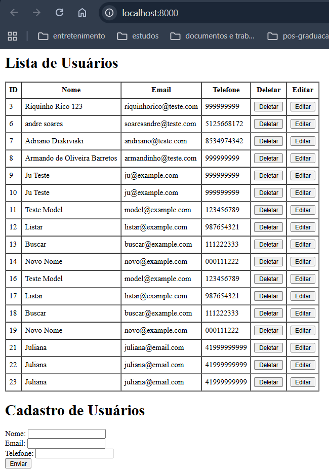
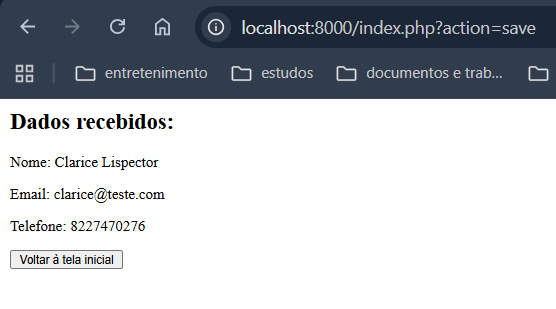
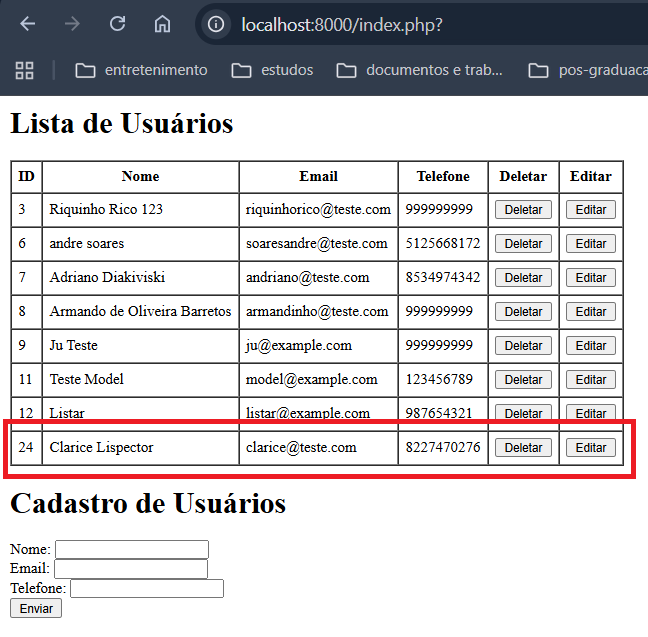
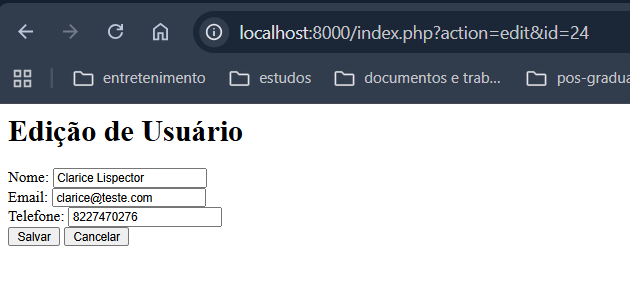
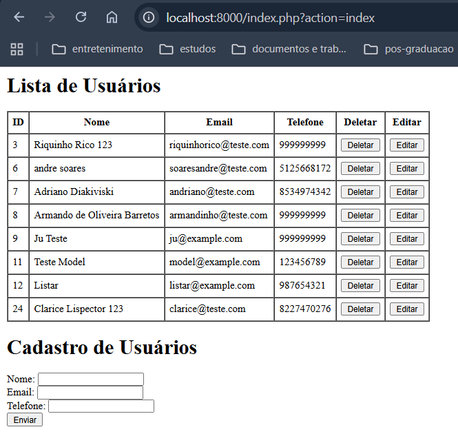
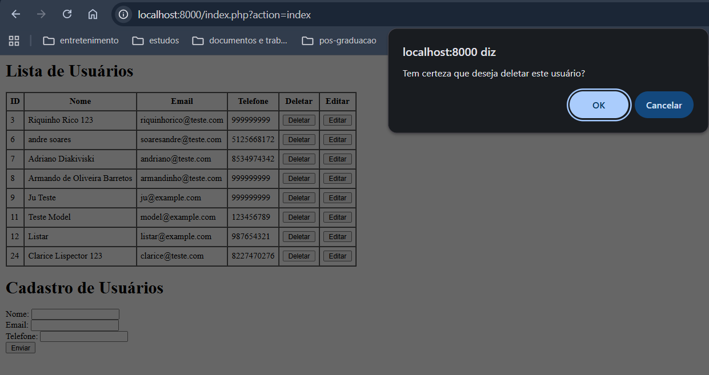
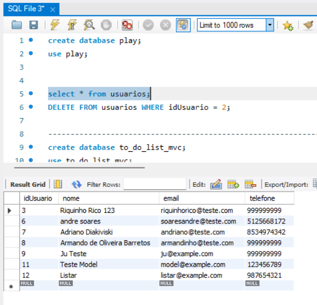

# Quarto passo: Estruturar o projeto de CRUD no padrão MVC com conexão ao banco de dados MySQL

<details> <summary> Estrutura do Projeto ANTES da refatoração </summary>

```bash
fourth
├── controller
│   └── UserController.php # Conecta Model e View, possui dois metodos index: formulario e salvar
├── model
│   └── UserModel.php # Classe que representa o modelo de dados do usuário e interage com o banco de dados
│   └── ConnectionDB.php # Classe que gerencia a conexão com o banco de dados
│   └── env.php # Carrega as variáveis de ambiente do arquivo .env
├── view
│   └── UserView.php # Redireciona a tela inicial para index.html e renderiza os dados do usuário no metodo Render quando chamado
│   └── list.html # Página para listar os usuários
│   └── data.html # Página para exibir os dados de um usuário recem cadastrado
├── test
│   └── test_connection.php # Arquivo para testar a conexão com o banco de dados - teste de unidade
│   └── test_user_model.php # Arquivo para testar as operações do UserModel - teste de unidade
│   └── test_user_controller.php # Arquivo para testar as operações do UserController - teste de unidade
│   └── test_user_view.php # Arquivo para testar as operações do UserView - teste de unidade
│   └── test_create_user.php # Arquivo para testar a criação de um usuário - teste de integração
├── .env # variáveis para a conexão no banco de dados
├── .gitignore # Usado para ignorar arquivos ao subir para o git, como arquivos com dados sensiveis como o .env
├── index.php # Ponto de entrada da aplicação, direciona para UserController
├── form.html # Formulário HTML para entrada de dados do usuário
├── README.md
```
---
</details>
<details><summary>Visualização dos resultados ao subir o servidor ANTES da refatoração</summary>

#### No terminal:
1. Acesse a pasta: 'cd practicing/fourth'
2. Depois suba o servidor: `php -S localhost:8000` 
3. E acesse `http://localhost:8000` no navegador para ver o formulário em funcionamento.


4. Após preencher e salvar formulario de Cadastro de usuário:


5. Voltar a tela inicial, novo usuário é apresentado em tela


6. Clicar no botão editar


7. Após incluir 123 no nome do usuário e salvar, usuário é redirecionado a tela inicial e novo nome é apresentado na lista


8. Clicar em deletar


9. No banco de dados


</details>

<details><summary>REFATORAÇÃO</summary>

### Tabela de itens analisados na 1ª refatoração

| Item                                           | Status | Observações                                                                 |
|------------------------------------------------|--------|------------------------------------------------------------------------------|
| Separação clara entre Controller, Model e View | ✅     | Estrutura bem definida, mas o Controller ainda mistura lógica de negócio     |
| Uso de funções reutilizáveis                   | ⚠️     | Algumas operações de banco estão duplicadas ou acopladas diretamente         |
| Validação de dados de entrada                  | ❌     | Não há validação no backend dos dados recebidos do formulário                |
| Tratamento de erros (try/catch)                | ❌     | A conexão com o banco não possui tratamento de exceções                      |
| Evita SQL Injection                            | ⚠️     | Uso direto de variáveis em queries pode ser perigoso sem prepared statements |
| Código comentado e legível                     | ✅     | Comentários explicativos estão presentes, mas podem ser mais detalhados      |
| Estrutura de pastas organizada                 | ✅     | Separação por responsabilidade está clara e intuitiva                        |

---

* Uso de funções reutilizáveis -> Algumas operações de banco estão duplicadas ou **Fortemente Acopladas**

> S -> Princípio da Responsabilidade Única (SRP) -> Esse princípio declara que uma classe deve ser especializada em um único assunto e possuir apenas uma responsabilidade dentro do software, ou seja, a classe deve ter uma única tarefa ou ação para executar.

> O -> Princípio Aberto-Fechado (OCP) -> Este princípio afirma que as classes devem ser abertas para extensão, mas fechadas para modificação. Isso significa que você deve ser capaz de adicionar novos comportamentos a uma classe sem alterar seu código existente.

> L -> Princípio da Substituição de Liskov (LSP) -> Este princípio estabelece que objetos de uma classe derivada devem poder substituir objetos da classe base sem alterar o comportamento desejado do programa.

> I -> Princípio da Segregação de Interface (ISP) -> Este princípio sugere que nenhuma classe deve ser forçada a implementar interfaces que não utiliza. Em vez disso, interfaces menores e mais específicas devem ser criadas.

> D -> Princípio da Inversão de Dependência (DIP) -> Este princípio afirma que módulos de alto nível não devem depender de módulos de baixo nível. Ambos devem depender de abstrações (interfaces). Além disso, as abstrações não devem depender de detalhes, mas os detalhes devem depender de abstrações.

</details>