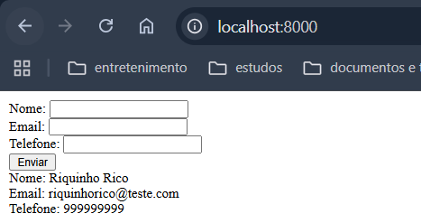

# Primeiro passo: Criar um formulário simples em PHP que receba e exiba os dados em tela

> **Nota:** Neste exemplo, HTML e PHP estão misturados para facilitar o entendimento inicial.  
> Em aplicações reais, recomenda-se separar a lógica de apresentação da lógica de negócios.  
> Nas próximas versões, essa separação será feita utilizando o padrão **MVC (Model-View-Controller)** para organizar melhor o código.

Atualmente, a estrutura consiste em um único arquivo que contém:
- Um formulário para envio de dados.
- A lógica de processamento dos dados enviados.

Para visualizar o resultado, execute o comando abaixo no terminal:

```bash
php -S localhost:8000
```
---
No terminal:
1. Acesse a pasta: 'cd praticando/first'
2. Depois suba o servidor: `php -S localhost:8000` 
3. E acesse `http://localhost:8000` no navegador para ver o formulário em funcionamento.
