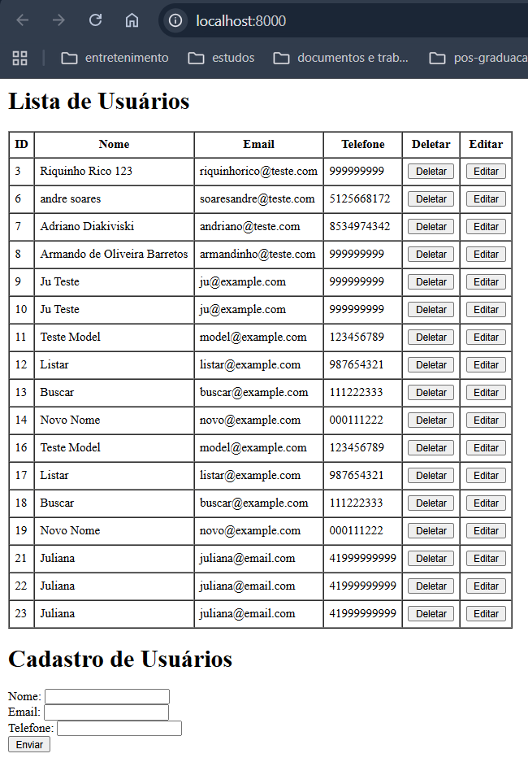
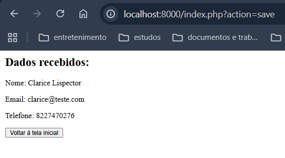
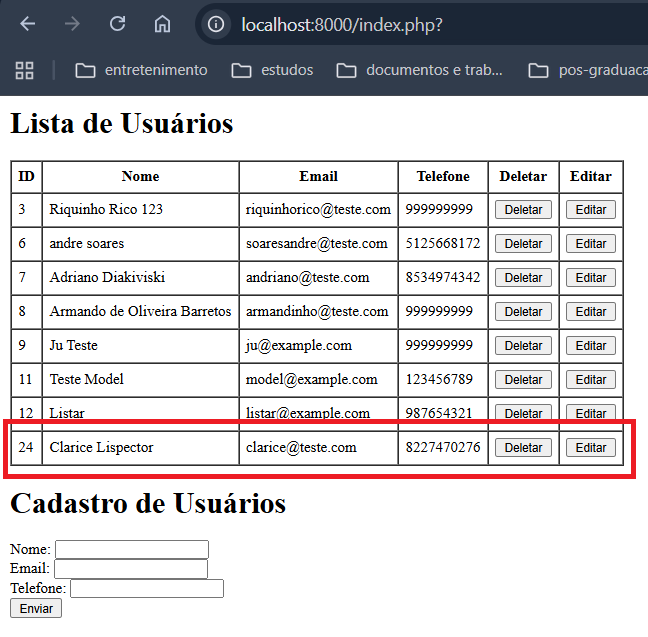
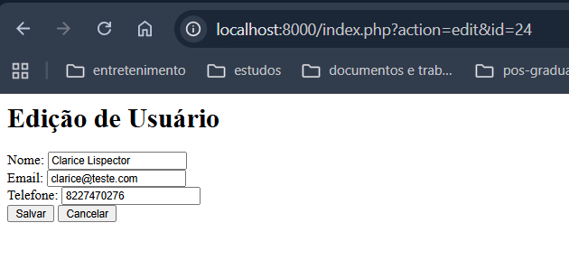
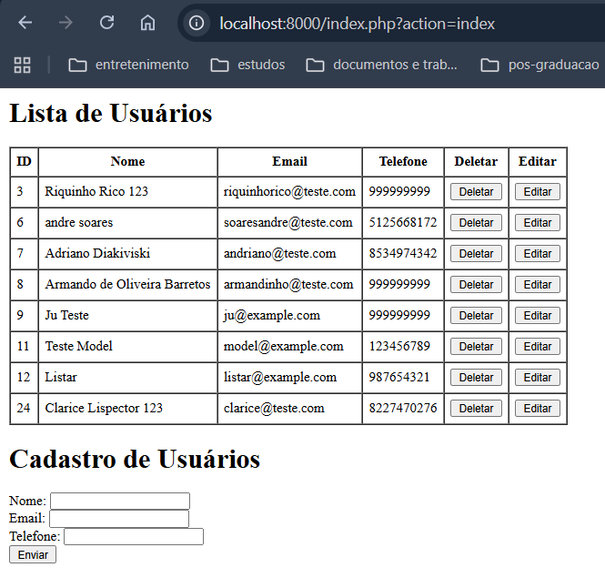
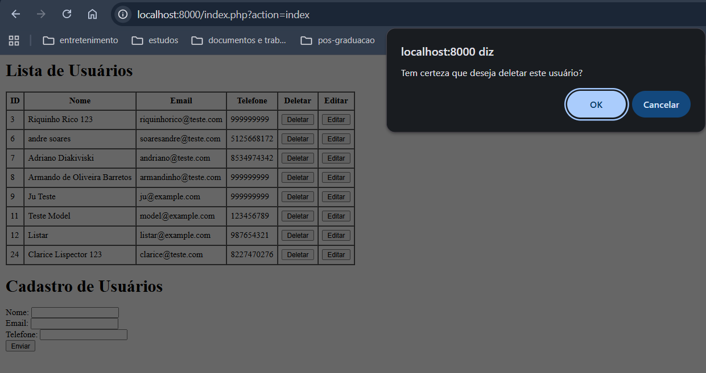
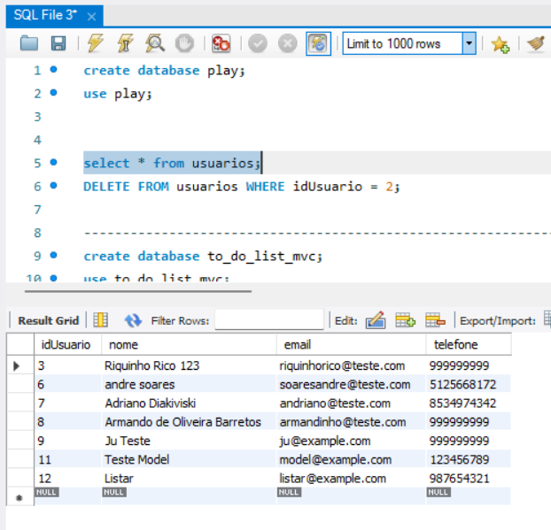

# Quarto passo: Estruturar o projeto de CRUD no padrão MVC com conexão ao banco de dados MySQL

### Estrutura do Projeto

```bash
fourth
├── controller
│   └── UserController.php # Conecta Model e View, possui dois metodos index: formulario e salvar
├── model
│   └── UserModel.php # Classe que representa o modelo de dados do usuário e interage com o banco de dados
│   └── ConnectionDB.php # Classe que gerencia a conexão com o banco de dados
│   └── env.php # Carrega as variáveis de ambiente do arquivo .env
├── view
│   └── UserView.php # Redireciona a tela inicial para index.html e renderiza os dados do usuário no metodo Render quando chamado
│   └── list.html # Página para listar os usuários
│   └── data.html # Página para exibir os dados de um usuário recem cadastrado
├── test
│   └── test_connection.php # Arquivo para testar a conexão com o banco de dados
├── .env # variáveis para a conexão no banco de dados
├── .gitignore # Usado para ignorar arquivos ao subir para o git, como arquivos com dados sensiveis como o .env
├── index.php # Ponto de entrada da aplicação, direciona para UserController
├── form.html # Formulário HTML para entrada de dados do usuário
├── README.md
```
---
Para visualizar o resultado, execute o comando abaixo no terminal:

```bash
php -S localhost:8000
```

No terminal:
1. Acesse a pasta: 'cd practicing/fourth'
2. Depois suba o servidor: `php -S localhost:8000` 
3. E acesse `http://localhost:8000` no navegador para ver o formulário em funcionamento.


4. Após preencher e salvar formulario de Cadastro de usuário:


5. Voltar a tela inicial, novo usuário é apresentado em tela


6. Clicar no botão editar


7. Após incluir 123 no nome do usuário e salvar, usuário é redirecionado a tela inicial e novo nome é apresentado na lista


8. Clicar em deletar


9. No banco de dados
