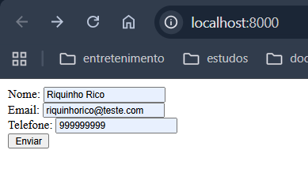
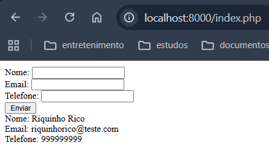
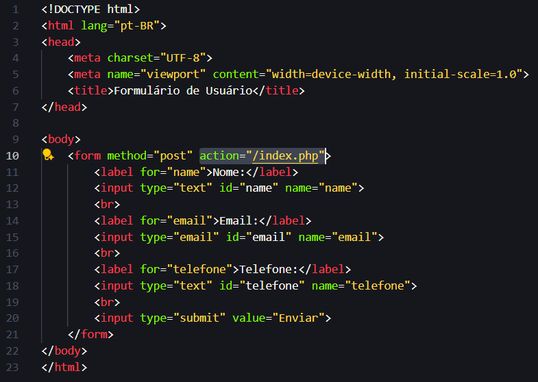

# Segundo passo: Separar HTML do PHP

> **Nota:** Neste exemplo, HTML e PHP estão separados em dois arquivos para facilitar o entendimento inicial.  

Atualmente, a estrutura consiste em dois arquivos que contêm:
- 'index.html': Um formulário para envio de dados.
- 'index.php': A lógica de processamento dos dados enviados.

Para visualizar o resultado, execute o comando abaixo no terminal:

```bash
php -S localhost:8000
```

---
No terminal:
1. Acesse a pasta: 'cd praticando/second'
2. Depois suba o servidor: `php -S localhost:8000` 
3. E acesse `http://localhost:8000` no navegador para ver o formulário em funcionamento.


---
Após Enviar o formulário, os dados serão exibidos na tela.
> Note que a tela exibida é a mesma do primeiro exercício, mas agora com a separação entre HTML e PHP a URL muda, passando a ser `http://localhost:8000/index.php`.


A alteração da URL ocorre por conta da *'action'* do formulário, que agora aponta para o arquivo `index.php`.

